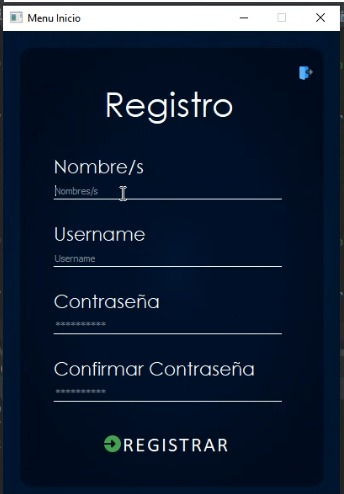

Nombre del proyecto: Pysearch V1.2 Demo

Grupo #2
Ingrantes:
1. Yuli Tatiana Infante Ruiz
2. Edwin Felipe Franco Sanchez
3. Sergio Octavio Garcés Nieto

Objetivo: Programa que permita que el usuario acceda y conozca fácilmente la programación y catálogo de contenido de un canal de televisión dando lugar a la optimización de su propio tiempo haciendo útil dicha actividad. 

Librerías Utilizadas:
- BeautifulSoup4
- PyQt5
- sqlite

Para usar las librerías debe descargar "requirements.txt" y ejecutar en el cmd :
- pip install -r requirements.txt

Información basica para ejecutar el programa:
- Requiere de Python para que se ejecute,  preferiblemente 3.7 en adelante.
- Se deben ejecutar los comandos descritos en "requirements.txt"

Imagenes:

